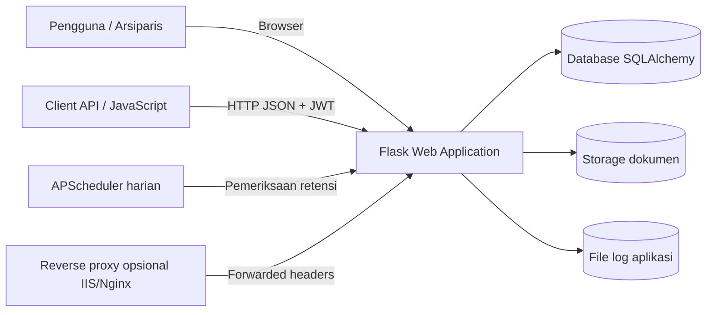
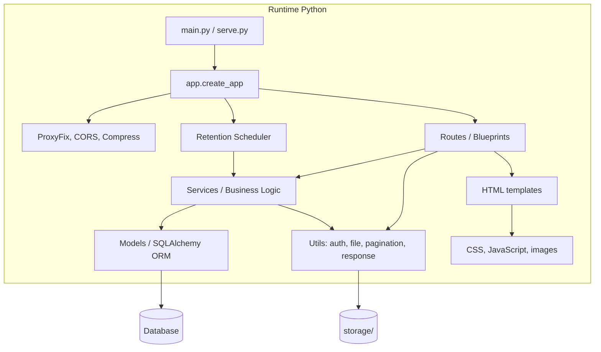
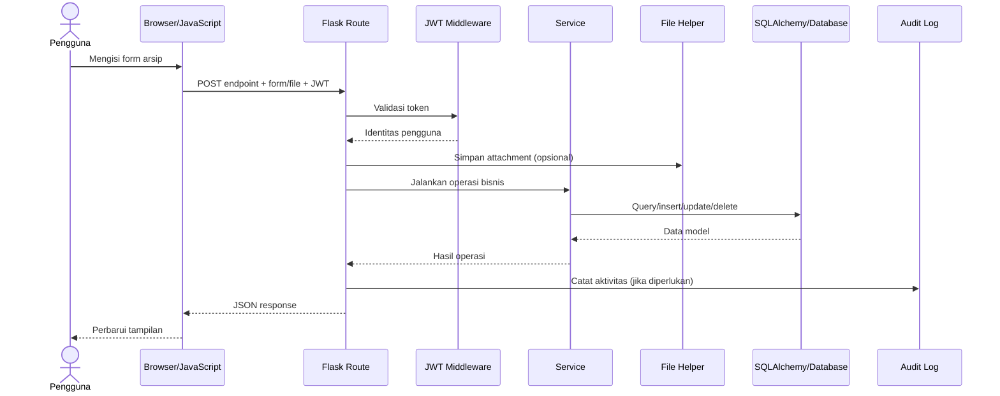
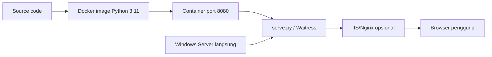

# Arsitektur Aplikasi Sistem Tupoksi Arsiparis

Dokumen ini menjelaskan arsitektur teknis aplikasi berdasarkan struktur source code saat ini.

## 1. Ringkasan

Aplikasi menggunakan arsitektur modular berbasis Python Flask dengan pola **application factory**, **Blueprint**, **service layer**, dan **SQLAlchemy ORM**. Aplikasi menyediakan antarmuka web melalui template HTML dan aset statis, sekaligus API JSON untuk pengelolaan arsip.

Karakteristik utama:

- Runtime: Python 3.11.
- Web framework: Flask.
- Server produksi: Waitress melalui `serve.py`.
- Database: database yang kompatibel dengan SQLAlchemy; konfigurasi utama berasal dari `DATABASE_URL`.
- Autentikasi API: JWT melalui `flask-jwt-extended`.
- File arsip: disimpan pada folder `storage/`.
- Pekerjaan terjadwal: APScheduler untuk pemeriksaan masa retensi arsip.
- Deployment: dapat dijalankan langsung pada Windows/server atau melalui Docker.

## 2. Diagram Konteks



## 3. Diagram Container Aplikasi



## 4. Struktur Modul

```text
.
├── main.py                         Entry point Flask untuk pengembangan
├── serve.py                        Entry point server produksi Waitress
├── app/
│   ├── __init__.py                 Application factory dan registrasi Blueprint
│   ├── core/
│   │   ├── config.py               Konfigurasi berbasis environment/.env
│   │   └── database.py             Engine, SessionLocal, dan declarative Base
│   ├── models/                     Entitas database dan relasi ORM
│   ├── routes/                     HTTP routes dan endpoint API per fitur
│   ├── services/                   Logika bisnis dan operasi database
│   ├── utils/                      Helper lintas fitur
│   └── static/
│       ├── html/                   Template halaman web
│       ├── css/                    Stylesheet
│       ├── js/                     Client-side logic dan pemanggilan API
│       └── img/                    Aset gambar
├── storage/                        File dokumen arsip yang diunggah
├── database/backups/                Hasil backup database
├── logs/                           File log aplikasi
└── config/                         Konfigurasi/deployment tambahan
```

## 5. Lapisan dan Tanggung Jawab

### Entry point dan application factory

- `main.py` membuat aplikasi melalui `create_app()` dan memasang `ProxyFix` untuk dukungan reverse proxy.
- `app/__init__.py` membuat instance Flask, mengaktifkan CORS dan compression, menginisialisasi JWT, logging, tabel database, scheduler, serta seluruh Blueprint.
- `serve.py` digunakan untuk menjalankan aplikasi dengan Waitress pada deployment produksi.

### Routes / API layer

Modul pada `app/routes/` menerima request, memeriksa autentikasi, membaca parameter/form/file, memanggil service, dan mengembalikan response HTML atau JSON.

Blueprint yang terdaftar:

| Prefix | Modul | Area fungsi |
|---|---|---|
| `/auth` | `auth` | Login, token, dan autentikasi |
| `/user` | `user` | Pengguna |
| `/classification` | `classification` | Klasifikasi arsip |
| `/incoming_letter` | `incoming_letter` | Surat masuk |
| `/outgoing_letter` | `outgoing_letter` | Surat keluar |
| `/diploma` | `diploma` | Ijazah |
| `/log` | `log` | Audit log |
| `/backup` | `backup` | Backup database |
| `/page` | `views` | Halaman web |
| `/storage` | `storage` | Penyimpanan/download dokumen |
| `/storage_location` | `storage_location` | Lokasi penyimpanan |
| `/finance_archive` | `finance_archive` | Arsip keuangan |
| `/employee_archive` | `employee_archive` | Arsip pegawai |
| `/disposal` | `disposal` | Penyusutan/pemusnahan arsip |
| `/teacher` | `teacher` | Data guru |
| `/reference` | `master_reference` | Referensi master |

### Service layer

`app/services/` menampung operasi bisnis agar routes tidak menjadi tempat utama untuk query dan mutasi data. Contohnya, service arsip keuangan mengelola pembuatan, perubahan, penghapusan, pengurutan, dan pagination data `FinanceArchive`.

### Model dan database

`app/models/` mendefinisikan tabel, kolom, foreign key, relationship, dan serialisasi data. `app/core/database.py` menyediakan:

- `engine` dari `DATABASE_URL`.
- `SessionLocal` sebagai factory session SQLAlchemy.
- `Base` sebagai declarative base seluruh model.
- `NullPool` untuk SQLite dan `QueuePool` untuk database non-SQLite.
- health check koneksi melalui `pool_pre_ping` dan recycle koneksi setiap 3600 detik.

Saat application factory dijalankan, `Base.metadata.create_all(bind=engine)` memastikan tabel model tersedia.

### Utilitas dan penyimpanan file

Helper pada `app/utils/` menangani hashing password, pagination, standardisasi response/error, database helper, dan upload file. Dokumen fisik berada di `storage/documents/` atau subfolder fitur terkait, sedangkan database menyimpan path file pada kolom seperti `attachment_path`.

## 6. Alur Request API



## 7. Autentikasi dan Keamanan

- Endpoint yang memerlukan identitas menggunakan decorator `@jwt_required()`.
- `JWT_SECRET_KEY` dan `DATABASE_URL` dibaca dari environment atau `.env` melalui Pydantic Settings.
- Cookie session dikonfigurasi `HttpOnly` dan `SameSite=Lax`.
- CORS diaktifkan dengan dukungan credentials karena frontend berkomunikasi dengan API.
- `ProxyFix` mempercayai header `X-Forwarded-*` dari reverse proxy.
- Aktivitas perubahan data dapat dicatat melalui modul log.
- Password diproses melalui helper hashing pada `app/utils/hash.py`.

Catatan deployment: `SESSION_COOKIE_SECURE` masih bernilai `False` pada konfigurasi saat ini. Nilai tersebut perlu diubah menjadi `True` ketika aplikasi sudah berjalan di HTTPS. Secret key juga sebaiknya dipindahkan sepenuhnya ke environment variable dan tidak ditulis hardcoded di source code.

## 8. Proses Background dan Retensi Arsip

Saat aplikasi berjalan dalam mode yang sesuai, APScheduler mendaftarkan job `check_and_deactivate_archives` dengan jadwal harian pukul 00:01. Job ini memeriksa masa retensi dan menonaktifkan arsip yang sudah memenuhi ketentuan. Scheduler dihentikan melalui `atexit` saat proses aplikasi berhenti.

## 9. Deployment



`Dockerfile` memasang dependensi sistem untuk koneksi MySQL, menginstal `requirements.txt`, menyalin source code, membuka port 8080, dan menjalankan `python serve.py`.

## 10. Kontrak Konfigurasi

| Variable | Keterangan |
|---|---|
| `DATABASE_URL` | URL koneksi database SQLAlchemy |
| `JWT_SECRET_KEY` | Secret untuk token JWT |
| `SECRET_KEY` | Secret aplikasi/session tambahan |
| `FLASK_ENV` | Mode environment, default `production` |
| `FLASK_DEBUG` | Mengaktifkan debug mode |
| `LOG_FILE_PATH` | Lokasi file log opsional |

## 11. Batasan Arsitektur Saat Ini

- Inisialisasi tabel dilakukan otomatis saat startup melalui `create_all`; belum terlihat penggunaan migration tool pada struktur utama.
- Scheduler berjalan di dalam proses web application. Pada deployment multi-worker, perlu pengaturan agar job tidak berjalan ganda.
- CORS bersifat global. Untuk produksi, origin sebaiknya dibatasi ke domain frontend yang dikenal.
- File upload dan database menggunakan dua media penyimpanan terpisah, sehingga penghapusan atau penggantian file perlu menjaga konsistensi keduanya.
