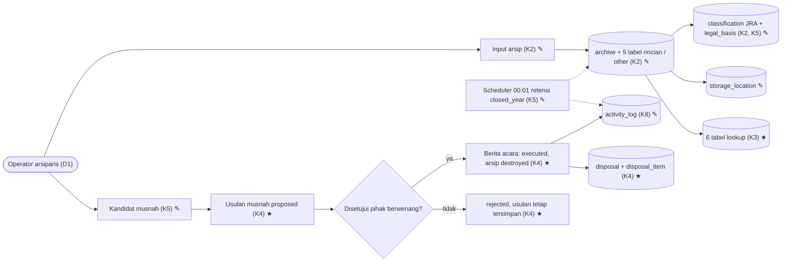
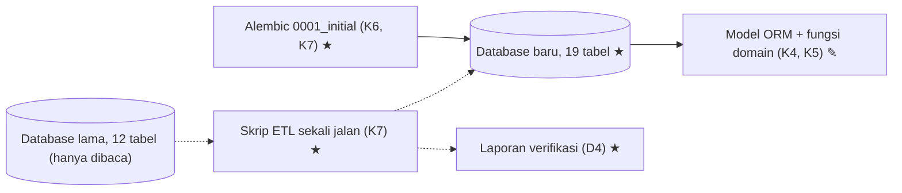

# 001a · Dev · Desain ulang basis data

Disetujui: 2026-10-04
Produk: Sistem Tupoksi Arsiparis SMKN 7 Bandung · Jenis: Aplikasi bisnis (web, Flask + MySQL) · Data: tingkat 3 (data produksi di database MySQL lama), mode data rahasia tidak aktif
Dasar: — (rancangan pertama di project ini; berangkat dari kode yang sudah berjalan di branch refactor/major-overhaul)
Dokumen terkait: docs/keputusan-produk.md | docs/rencana-evaluasi.md (belum ada — dirancang setelah rancangan ini sesuai TP4)

## Diagram alur





## Yang dirancang atau diubah

Rancangan pertama untuk area basis data. Pembandingnya adalah kondisi kode sekarang:

| Jenis | Bagian / keputusan | Sebelumnya | Sekarang |
|---|---|---|---|
| Diubah | D1 Pengguna | 3 role (admin/headmaster/teacher), hanya di menu | Satu operator (arsiparis), tanpa role |
| Baru | D2 Cakupan | — | Skema baru, migrasi Alembic, skrip ETL, model ORM baru, fungsi domain transisi status dan rumus retensi + test. Service/route, keamanan, dan front-end tidak dikerjakan; produksi tetap memakai database lama sampai cutover di rancangan back-end |
| Baru | D4 Tanda berhasil | — | (1) Jumlah baris per jenis arsip, pegawai, klasifikasi, dan lokasi sama dengan DB lama. (2) Tidak ada nilai status tetap yang gagal dipetakan. (3) Setelah scheduler baru dijalankan sekali, kandidat musnah identik 100% dengan `/disposal/check` lama untuk semua jenis kecuali ijazah (ijazah sengaja 0 kandidat). (4) Admin lama bisa login dengan username = NIP lama |
| Diubah | K1 Akun | `user` → `teacher`, role Enum | `app_user` tanpa role, tanpa relasi ke pegawai |
| Diubah | K2 Struktur arsip | 5 tabel arsip lepas | `archive` + 5 tabel rincian (Class Table Inheritance) + jenis `other`; `classification.code` VARCHAR(30) + `legal_basis` |
| Diubah | K3 Nilai pilihan | `master_reference` berisi string bebas | 6 tabel lookup + FK; status yang menggerakkan logika dikunci dengan CHECK |
| Diubah | K4 Status & penyusutan | `archive_status` string bebas; pemusnahan tanpa jejak | State machine arsip 4 status + disposal proposed → approved → executed / rejected + `disposal_item` |
| Diubah | K5 Retensi | 2 rumus berbeda, loop Python | 1 rumus per tahun dari `closed_year` dalam SQL |
| Diubah | K6 Physical | `create_all`, DATETIME, BIGINT, ENUM | InnoDB utf8mb4, VARCHAR + CHECK, DATE, DECIMAL, naming convention, 6 indeks |
| Baru | K7 Migrasi | Tidak ada (`create_all` saat startup) | Alembic untuk skema baru + skrip ETL sekali jalan ke database baru |
| Diubah | K8 Log & backup | `log` teks bebas, `user_id` NOT NULL; tabel `backup` tidak dipakai | `activity_log` terstruktur, `user_id` boleh kosong; tabel `backup` dihapus, riwayat tetap di `backup_logs.json` |
| Dihapus | Tabel lama | `user`, `teacher`, `log`, `backup`, `master_reference`, `incoming_letter`, `outgoing_letter`, `diploma`, `finance_archive`, `employee_archive` | Diganti 19 tabel baru; tabel lama tetap ada di database lama |

Tidak berubah: engine MySQL, Flask, SQLAlchemy 2.0, APScheduler 00:01, mysqldump + `backup_logs.json`, delapan domain UI/UX (ditunda ke rancangan front-end).

### Model data — Conceptual
- Satu **Arsip** punya tepat satu jenis (surat masuk, surat keluar, ijazah, keuangan, dokumen pegawai, lainnya), satu **Klasifikasi** JRA, dan paling banyak satu **Lokasi Simpan**.
- Satu **Usulan Pemusnahan** memuat banyak Arsip. Satu Arsip bisa masuk beberapa usulan dari waktu ke waktu, tetapi paling banyak satu usulan yang masih berjalan dan paling banyak satu usulan yang dieksekusi.
- Satu **Pegawai** memiliki banyak Dokumen Pegawai.
- Satu **Akun** melakukan banyak **Aktivitas** dan membuat banyak Usulan Pemusnahan.
- Daftar pilihan (jurusan, kategori dana, jenis dokumen, status kepegawaian, golongan, status aktif) dirujuk oleh Ijazah, Keuangan, Dokumen Pegawai, dan Pegawai.

### Model data — Logical
Aturan umum: semua tabel punya `created_at DATETIME NOT NULL DEFAULT CURRENT_TIMESTAMP`; tabel yang bisa diubah juga punya `updated_at DATETIME NOT NULL DEFAULT CURRENT_TIMESTAMP ON UPDATE CURRENT_TIMESTAMP` (kecuali `disposal_item` dan `activity_log`, yang hanya insert). Primary key memakai surrogate integer. FK tanpa keterangan berperilaku RESTRICT. Target normalisasi 3NF.

| Entitas | Isi | Kunci | Relasi | Aturan integritas |
|---|---|---|---|---|
| `archive` | `archive_type` VARCHAR(20), `title` VARCHAR(255), `description` TEXT NULL, `archive_year` SMALLINT (tahun dokumen), `closed_year` SMALLINT NULL (tahun berkas selesai = dasar retensi), `status` VARCHAR(20) DEFAULT 'active', `development_level` VARCHAR(10) NULL, `attachment_path` VARCHAR(255) NULL, `status_changed_at` DATETIME NULL | PK `id` BIGINT | `classification_id` NOT NULL → classification; `storage_location_id` NULL → storage_location; 1:N disposal_item | `archive_type` IN ('incoming_letter','outgoing_letter','diploma','finance_record','employee_document','other'); `status` IN ('active','inactive','destroyed','permanent'); `development_level` IN ('asli','salinan','tembusan'); `archive_year` BETWEEN 1900 AND 2100; `closed_year` IS NULL OR (`closed_year` BETWEEN 1900 AND 2100 AND `closed_year` ≥ `archive_year`); status='destroyed' ⇒ attachment_path IS NULL; jenis `other` tidak punya baris rincian |
| `incoming_letter` | `letter_number` VARCHAR(100), `letter_date` DATE, `received_date` DATE, `sender` VARCHAR(150) | PK = FK `archive_id` → archive ON DELETE CASCADE | 1:1 archive | UNIQUE (`sender`, `letter_number`); `archive_year` = YEAR(`letter_date`) (dijaga service) |
| `outgoing_letter` | `letter_number` VARCHAR(100), `letter_date` DATE, `sent_date` DATE NULL, `destination` VARCHAR(150), `is_decree` BOOLEAN DEFAULT 0, `approval_status` VARCHAR(10) DEFAULT 'pending' | PK = FK `archive_id` CASCADE | 1:1 archive | UNIQUE `letter_number`; `approval_status` IN ('draft','pending','approved','rejected'); `archive_year` = YEAR(`letter_date`) |
| `diploma` | `diploma_number` VARCHAR(100), `student_name` VARCHAR(150), `collected_at` DATE NULL | PK = FK `archive_id` CASCADE | `school_major_id` NOT NULL → school_major | UNIQUE `diploma_number`; sudah diambil ⇔ `collected_at` IS NOT NULL; tahun ajaran = `archive_year`/`archive_year`+1; `archive.title` diisi service: "Ijazah <student_name>"; `closed_year` diisi service = YEAR(`collected_at`), atau kosong bila belum diambil |
| `finance_record` | `period_month` TINYINT NULL, `amount` DECIMAL(15,2) NULL | PK = FK `archive_id` CASCADE | `finance_category_id` NOT NULL → finance_category | `period_month` BETWEEN 1 AND 12; `amount` ≥ 0; tahun anggaran = `archive_year` |
| `employee_document` | (hanya FK) | PK = FK `archive_id` CASCADE | `employee_id` NOT NULL → employee (RESTRICT); `document_type_id` NOT NULL → document_type | tahun dokumen = `archive_year` |
| `classification` | `code` VARCHAR(30), `name` VARCHAR(150), `description` TEXT NULL, `retention_active_years` SMALLINT, `retention_inactive_years` SMALLINT, `final_action` VARCHAR(10), `legal_basis` VARCHAR(255) NULL, `is_active` BOOLEAN DEFAULT 1 | PK `id` INT | 1:N archive | UNIQUE `code` (format kode Permendagri 83/2022, mis. "400.3.10"); kedua retensi ≥ 0; `final_action` IN ('destroy','permanent','assess'); `legal_basis` = rujukan baris JRA; tidak bisa dihapus selama dipakai |
| `storage_location` | `name` VARCHAR(100), `description` TEXT NULL, `is_active` BOOLEAN DEFAULT 1 | PK `id` INT | 1:N archive | UNIQUE `name`; tidak bisa dihapus selama dipakai |
| `disposal` | `proposal_number` VARCHAR(100), `proposal_date` DATE, `status` VARCHAR(10) DEFAULT 'proposed', `approval_reference` VARCHAR(150) NULL, `approval_date` DATE NULL, `approver` VARCHAR(150) NULL, `minutes_number` VARCHAR(100) NULL, `executed_date` DATE NULL, `notes` TEXT NULL, `proposal_file_path` VARCHAR(255) NULL, `minutes_file_path` VARCHAR(255) NULL | PK `id` INT | 1:N disposal_item; `created_by_user_id` NULL → app_user ON DELETE SET NULL | UNIQUE `proposal_number`; UNIQUE `minutes_number`; `status` IN ('proposed','approved','rejected','executed'); status IN ('approved','executed') ⇒ approval_reference, approval_date NOT NULL; status='executed' ⇒ minutes_number, executed_date NOT NULL; approval_date ≥ proposal_date; executed_date ≥ approval_date |
| `disposal_item` | (hanya FK) | PK (`disposal_id`, `archive_id`) | `disposal_id` → disposal ON DELETE CASCADE; `archive_id` → archive (RESTRICT) | Satu arsip paling banyak di satu disposal proposed/approved dan paling banyak di satu disposal executed (service + test) |
| `employee` | `identity_number` VARCHAR(30), `full_name` VARCHAR(150), `gender` CHAR(1), `address` TEXT NULL | PK `id` INT | `employment_status_id` NOT NULL, `employee_rank_id` NULL, `active_status_id` NOT NULL → lookup; 1:N employee_document | UNIQUE `identity_number`; `gender` IN ('L','P'); data pribadi hanya di tabel ini dan tidak ditulis ke log |
| `app_user` | `username` VARCHAR(50), `password_hash` VARCHAR(255), `display_name` VARCHAR(100), `is_active` BOOLEAN DEFAULT 1, `last_login_at` DATETIME NULL | PK `id` INT | 1:N activity_log, 1:N disposal | UNIQUE `username`; login ditolak bila `is_active`=0 |
| `activity_log` | `action` VARCHAR(30), `entity_type` VARCHAR(30) NULL, `entity_id` BIGINT NULL, `summary` TEXT | PK `id` BIGINT | `user_id` NULL → app_user ON DELETE SET NULL (kosong = sistem) | `entity_id` tanpa FK; `summary` tanpa NIP, alamat, atau nama pegawai; hanya insert |
| Lookup ×6: `school_major`, `employment_status`, `employee_rank`, `employee_active_status`, `finance_category`, `document_type` | `code` VARCHAR(30), `name` VARCHAR(150), `sort_order` SMALLINT DEFAULT 0, `is_active` BOOLEAN DEFAULT 1 | PK `id` INT | 1:N ke tabel perujuk | UNIQUE `code`; hapus = `is_active`=0 |

**Transisi status `archive.status`:**
| Dari → Ke | Pemicu | Syarat |
|---|---|---|
| (baru) → active | Input arsip | — |
| active → inactive | Scheduler harian atau manual | Scheduler: `closed_year` terisi dan `closed_year + retention_active_years < YEAR(today)`; manual: kapan saja |
| inactive → active | Manual (dinilai kembali / masih dipakai) | Tidak sedang berada di disposal proposed/approved |
| inactive → destroyed | Hanya saat disposal-nya dieksekusi | Arsip ada di disposal yang berubah approved → executed |
| inactive → permanent | Manual (penetapan permanen) | `final_action` ∈ {permanent, assess} |
| destroyed, permanent | — | Status akhir |
Aturan tambahan: data arsip hanya bisa diedit saat status active atau inactive. Baris arsip hanya bisa dihapus fisik saat status active dan belum pernah masuk disposal. Status tidak boleh diubah lewat endpoint update umum.

**Transisi status `disposal.status`:**
| Dari → Ke | Syarat |
|---|---|
| (baru) → proposed | Semua item: arsip inactive, lewat masa inaktif (K5), `final_action` ∈ {destroy, assess}, tidak ada di disposal lain yang proposed/approved |
| proposed → approved | `approval_reference` dan `approval_date` diisi |
| proposed → rejected | — (item tetap tersimpan sebagai riwayat; arsip tetap inactive) |
| approved → executed | `minutes_number` dan `executed_date` diisi; dalam satu transaksi semua arsip item → destroyed, lalu file lampiran dihapus setelah commit |
| rejected, executed | Status akhir; tidak bisa diubah atau dihapus |
Item hanya bisa ditambah atau dihapus saat status proposed. Disposal hanya bisa dihapus saat proposed.

## Rincian engineering

```
K1 · Single-operator account model — Umum
Pendekatan   app_user(id, username UNIQUE, password_hash, display_name,
             is_active, last_login_at, timestamps); tanpa role, tanpa FK
             ke employee
Parameter    Hash lama dipindah apa adanya (argon2 atas prehash SHA-256,
             app/utils/hash.py); kolom 255. Setiap user lama → app_user
             dengan id sama; username = teacher.identity_number;
             display_name = teacher.full_name; is_active = (status='active'
             AND role='admin')
Metrik       D4-4: admin lama login dengan NIP + sandi lama
```
| Pendekatan ditolak | Karena |
|---|---|
| Role + relasi ke teacher | Pengguna hanya satu (A1) |
| Kredensial di variabel lingkungan | Sandi tidak bisa diganti dari aplikasi; tidak ada baris yang dirujuk log |

```
K2 · Class Table Inheritance — Umum
Pendekatan   archive (atribut bersama + siklus hidup) + incoming_letter,
             outgoing_letter, diploma, finance_record, employee_document
             (PK = FK archive_id, ON DELETE CASCADE). archive_type 'other'
             tanpa baris rincian, untuk arsip tupoksi lain ber-JRA (buku
             induk, leger, SK kepala sekolah, inventaris)
Parameter    archive_year: surat = YEAR(letter_date); ijazah = tahun awal
             tahun ajaran; keuangan = tahun anggaran; pegawai dan other =
             tahun dokumen. Klasifikasi wajib untuk semua jenis. Induk +
             rincian ditulis dalam satu transaksi.
             Placeholder dari ETL (is_active 0):
               IJZ        "Ijazah (sementara — ganti dengan kode JRA resmi)"
                          aktif 5, inaktif 0, assess
               TANPA-KLAS "Belum diklasifikasi"  aktif 0, inaktif 0, assess
Metrik       D4-1: jumlah baris per jenis = tabel lama
```
| Pendekatan ditolak | Karena |
|---|---|
| Lima tabel terpisah | Logika ditulis lima kali (T12–T13) |
| Single table + JSON | Atribut khusus kehilangan constraint |
| Tabel rincian baru untuk setiap jenis tupoksi | Belum ada atribut khusus yang diminta |

```
K3 · Per-category lookup tables + fixed-domain CHECK — Umum [S6]
Pendekatan   6 tabel lookup (code UNIQUE, name, sort_order, is_active),
             dirujuk lewat FK id. Status arsip, status disposal,
             final_action, approval_status, archive_type, gender,
             development_level → VARCHAR + CHECK; label di aplikasi
Parameter    school_major → school_major; teacher_emp_status →
             employment_status; teacher_rank → employee_rank;
             teacher_active_status → employee_active_status;
             finance_category → finance_category; emp_doc_type →
             document_type; archive_status, letter_approval_status,
             final_action → CHECK
Metrik       Tidak ada kolom string bebas yang menyimpan nilai referensi
```
| Pendekatan ditolak | Karena |
|---|---|
| Satu tabel referensi umum + FK | Kategori FK tidak dijamin database |
| ENUM native | ALTER untuk nilai baru, terikat MySQL |

```
K4 · Lifecycle state machines + disposal proposal/approval/minutes
     — Umum [S7, S11]
Pendekatan   Dua state machine (tabel transisi di atas). Alur: daftar
             usul musnah (disposal proposed + disposal_item) → persetujuan
             (approval_reference, approval_date, approver) → berita acara
             (minutes_number, executed_date, scan opsional)
Parameter    Eksekusi = 1 transaksi: disposal → executed; arsip item →
             destroyed, status_changed_at = NOW(), attachment_path = NULL;
             1 activity_log 'disposal_execute'; file dihapus setelah commit
             CHECK disposal: ck_disposal_status, ck_disposal_approved_
             fields, ck_disposal_executed_fields, ck_disposal_dates
             CHECK archive: ck_archive_destroyed_file (status <>
             'destroyed' OR attachment_path IS NULL)
             Lintas tabel (destroyed ⇔ item di disposal executed; ≤ 1
             disposal terbuka per arsip) → fungsi domain + test
             Destroyed lama → 1 disposal executed: proposal_number =
             minutes_number = 'PRA-MIGRASI', approval_reference =
             'TIDAK-TERCATAT', 3 tanggal = tanggal ETL, notes "Dimusnahkan
             sebelum migrasi; usulan, persetujuan, dan berita acara tidak
             tercatat di sistem"
             Ambang 10 tahun PP 28/2012 tidak dikunci; penyetuju = teks
Metrik       Test semua pasangan transisi arsip dan disposal (sah
             diterima, tidak sah ditolak)
```
| Pendekatan ditolak | Karena |
|---|---|
| Status bebas lewat update (sekarang) | Arsip bisa langsung destroyed tanpa jejak |
| Hanya berita acara, archive.disposal_id | Usulan dan persetujuan tidak tercatat |
| Mengunci ambang 10 tahun di DB | Pihak berwenang untuk sekolah belum pasti |

```
K5 · Year-based retention from closed_year, at query time — Umum [S12]
Rumus        y = YEAR(tanggal hari ini)
             jatuh_inaktif ⇔ closed_year IS NOT NULL ∧
                             closed_year + r_aktif < y
             jatuh_akhir   ⇔ closed_year IS NOT NULL ∧
                             closed_year + r_aktif + r_inaktif < y
             kandidat_musnah   = inactive ∧ jatuh_akhir ∧ final=destroy
                                 ∧ tidak di disposal proposed/approved
             perlu_dinilai     = inactive ∧ jatuh_akhir ∧ final=assess
             kandidat_permanen = inactive ∧ jatuh_akhir ∧ final=permanent
             (r_aktif = retention_active_years, r_inaktif =
             retention_inactive_years dari classification)
Scheduler    harian 00:01: UPDATE archive a JOIN classification c ON
             c.id = a.classification_id SET a.status='inactive',
             a.status_changed_at=NOW() WHERE a.status='active' AND
             a.closed_year IS NOT NULL AND a.closed_year +
             c.retention_active_years < YEAR(CURDATE());
             lalu 1 activity_log (user_id NULL, 'retention_run', jumlah)
Parameter    closed_year awal = archive_year untuk semua jenis; ijazah =
             YEAR(collected_at) atau kosong bila belum diambil; operator
             boleh mengosongkan atau mengubah
Kenapa       x + n < y = "lewat 31 Des tahun x+n", sama dengan
             /disposal/check lama bila x = tahun dokumen
Metrik       D4-3: kandidat musnah identik 100% dengan /disposal/check
             lama (kecuali ijazah) setelah scheduler dijalankan sekali
```
| Pendekatan ditolak | Karena |
|---|---|
| Dari archive_year | Berkas yang masih berjalan jatuh inaktif terlalu cepat |
| Menyimpan active_until/inactive_until | Butuh sinkronisasi saat JRA berubah |
| Per tanggal (relativedelta) | Tidak konsisten dengan penyusutan dan keuangan lama |

```
K6 · Physical design MySQL 8 InnoDB — Umum [S1, S3, S6]
Pendekatan   InnoDB; utf8mb4 / utf8mb4_unicode_ci; MySQL ≥ 8.0.16.
             sqlalchemy.Enum(..., native_enum=False, create_constraint=
             True, length=n) → VARCHAR + CHECK; uang Numeric(15, 2);
             tanggal bisnis DATE, jejak waktu DATETIME
Naming       ix: "ix_%(column_0_label)s"
             uq: "uq_%(table_name)s_%(column_0_name)s"
             ck: "ck_%(table_name)s_%(constraint_name)s"
             fk: "fk_%(table_name)s_%(column_0_name)s_%(referred_table_name)s"
             pk: "pk_%(table_name)s"
Indeks       archive (archive_type, created_at)
             archive (status, closed_year)
             archive (archive_year)
             disposal (status)
             activity_log (created_at)
             activity_log (entity_type, entity_id)
             (+ PK, UNIQUE, indeks FK otomatis InnoDB)
Aturan       CHECK hanya pada kolom non-FK
Lampiran     Path relatif ke folder storage/ (tanpa awalan "storage/");
             baru: documents/<archive_type>/<uuid>.<ext>; scan usulan dan
             berita acara: documents/disposal/<uuid>.<ext>; path lama:
             awalan "storage/" dibuang (memperbaiki file_helper.py:40 vs :88)
Metrik       SHOW CREATE TABLE memuat semua CHECK/UNIQUE/FK model Logical
```
| Pendekatan ditolak | Karena |
|---|---|
| ENUM native | ALTER untuk nilai baru |
| BIGINT rupiah, DATETIME untuk tanggal surat | Bukan desimal; jam tidak bermakna |

```
K7 · Alembic for new schema + one-off ETL cutover — Umum [S2, S4, S5]
Pendekatan   Database baru; Alembic 0001_initial membuat 19 tabel;
             create_all saat startup dihapus. Alembic langsung (bukan
             Flask-Migrate; app memakai SQLAlchemy murni). 1.17.1 sudah di
             requirements, rilis 2025-10-28, MIT
ETL          1 Pra-cek, berhenti bila gagal: MySQL ≥ 8.0.16; DB baru kosong
               dan di head; nomor surat keluar ganda; archive_status/
               final_action/approval_status di luar domain; academic_year
               ijazah bukan YYYY/YYYY
             2 Salin dengan id dipertahankan: classification (+ IJZ,
               TANPA-KLAS; legal_basis kosong), storage_location, 6 lookup
               dari master_reference, teacher → employee, user → app_user
             3 String → FK: cocok code atau name (trim, case-insensitive);
               tidak cocok → baris lookup baru + dicatat. Gender L/Laki-laki
               → L, P/Perempuan → P; lainnya menghentikan ETL
             4 5 tabel arsip lama → archive + rincian; peta id lama → baru
               dicatat. title: surat = subject (kosong → "(Tanpa
               perihal)"), keuangan = title, pegawai = document_name,
               ijazah = "Ijazah <student_name>". closed_year = archive_year,
               ijazah = YEAR(collected_at) atau kosong. collected_at =
               DATE(collected_at) bila is_collected; is_collected tanpa
               tanggal → DATE(updated_at) + dicatat. Ijazah → IJZ; pegawai
               tanpa klasifikasi → TANPA-KLAS. Destroyed → disposal
               PRA-MIGRASI + item. Tidak ada arsip other dari data lama
             5 log → activity_log (user_id NULL, 'legacy', teks lama,
               timestamp lama)
             6 Lampiran: buang awalan "storage/"; file hilang dicatat
             7 Laporan verifikasi: D4-1..2, pemetaan, file hilang
Cutover      (di rancangan back-end) backup DB lama → ETL → verifikasi →
             ganti DATABASE_URL; jalan kembali = DATABASE_URL lama
Metrik       D4-1..3; ETL ulang di DB kosong memberi hasil yang sama
```
| Pendekatan ditolak | Karena |
|---|---|
| Revisi Alembic di tempat | DDL MySQL implicit commit [S2] |
| Mulai kosong | Arsip yang sudah tercatat hilang |

```
K8 · Structured activity log; drop backup table — Umum
Pendekatan   activity_log(user_id NULL = sistem, action, entity_type,
             entity_id tanpa FK, summary, created_at); hanya insert.
             action ∈ login, create, update, delete, status_change,
             disposal_propose, disposal_approve, disposal_reject,
             disposal_execute, retention_run, backup, restore, legacy.
             entity_type = nama tabel. Tabel backup dihapus; riwayat tetap
             di database/backups/backup_logs.json
Metrik       user_id valid atau NULL (FK); tidak ada NIP/alamat di
             summary (test)
```
| Pendekatan ditolak | Karena |
|---|---|
| Log teks bebas + user_id NOT NULL (sekarang) | Proses sistem tidak bisa dicatat; pelaku salah (T5–T6) |
| Riwayat backup di tabel | Restore menimpa riwayatnya sendiri |

## Laporan rancangan

Produk: Aplikasi bisnis (web) — Sistem Tupoksi Arsiparis SMKN 7 Bandung. Rancangan 001 mendesain ulang basis datanya.
Fase: Dev
Dasar: usulan 001 putaran sebelumnya (TP1–TP4 dijawab Arya, semua pilihan a) + koreksi Arya: cek aturan tupoksi arsiparis SMK di Indonesia sebelum skema dikunci.
Status: menunggu persetujuan → disetujui 2026-10-04

Diagnosis (hasil riset aturan kearsipan sekolah):
- SMKN dikelola Pemerintah Provinsi (urusan SMA/SMK ada di provinsi; pengetahuan umum), jadi yang berlaku adalah aturan kearsipan pemda provinsi: kode klasifikasi dari Permendagri 83/2022, masih berlaku, contohnya 400.3 Pendidikan dan 400.3.10 Pendidik & Tenaga Kependidikan [S8]; JRA dari Pergub Jabar 38/2019 (substantif) dan 75/2020 (fasilitatif keuangan, kepegawaian, umum), keduanya ditemukan dan berlaku [S9, S10]; tata naskah dinas dari Permendagri 1/2023 [S15].
- JRA Kemendikbud (Permendikbud 45/2016) hanya berlaku untuk unit kementerian dan sudah dicabut [S13]. Permendikdasmen 7/2026 tentang Penyelenggaraan Kearsipan juga hanya untuk unit kerja kementerian [S14]. Keduanya tidak dijadikan dasar.
- Menurut pedoman retensi ANRI sektor pendidikan, retensi dihitung sejak kegiatan atau berkas dinyatakan selesai [S12]. Rancangan sebelumnya menghitung dari tahun dokumen, jadi berkas pegawai yang masih aktif akan jatuh inaktif terlalu cepat.
- Pemusnahan untuk pemda provinsi tidak diputuskan sendiri oleh sekolah. Untuk retensi ≥ 10 tahun, pemusnahan ditetapkan gubernur setelah pertimbangan panitia penilai dan persetujuan Kepala ANRI [S11], dan wajib disertai daftar arsip usul musnah serta berita acara [S7]. Model "hanya berita acara" di versi sebelumnya tidak mencatat usulan dan persetujuan.
- Tupoksi arsiparis sekolah mencakup arsip lain di luar lima jenis yang ada (buku induk, leger, SK, inventaris). Saat ini arsip itu tidak bisa dicatat.
- Ijazah: ada indikasi arsip ijazah bersifat vital/permanen. Artinya aturan hard-code "musnah +5 tahun" (dan placeholder IJZ = destroy di versi sebelumnya) berisiko memusnahkan arsip yang seharusnya tidak dimusnahkan. Angka JRA resminya belum bisa dibaca.
- Keterbatasan riset: teks lengkap JRA Pergub Jabar, PP 28/2012, dan pedoman ANRI berupa PDF yang tidak bisa dibaca alat riset. Klaim S11 dan S12 diambil dari cuplikan hasil pencarian di situs resmi. Satu hasil (berkas jdih.anri) dibuang karena judul yang diekstrak tidak cocok dengan berkasnya dan tabelnya tampak dikarang. Karena itu skema tidak memuat angka retensi apa pun; angka diisi operator dari dokumen resmi.

Gambaran sistem:
```
Operator ──→ Input arsip ✎ ──→ [archive ✎] + [5 tabel rincian] / jenis other ★
                                   │ merujuk
        [classification ✎]  [storage_location]  [6 tabel lookup ★]
         kode Permendagri 83/2022 + legal_basis ★

Scheduler 00:01 ┄┄→ Retensi SQL dari closed_year (K5) ✎ ┄┄→ active → inactive

Operator ──→ Kandidat musnah (K5) ──→ Usulan [disposal: proposed ★]
                                          + [disposal_item ★]
               ──→ Persetujuan dicatat (nomor/tanggal/pejabat) → approved
               ──→ Berita acara → executed ──→ arsip destroyed, file dihapus
               ──→ (ditolak → rejected, usulan tetap tersimpan)

Sekali jalan: [DB lama] ┄┄→ Skrip ETL (K7) ┄┄→ [DB baru] ←── Alembic 0001
```

Model data:
```
[classification] 1──N [archive] N──1 [storage_location]
                         │ 1
                         └──N [disposal_item] N──1 [disposal]
[archive] 1──1 [incoming_letter]
[archive] 1──1 [outgoing_letter]
[archive] 1──1 [diploma] N──1 [school_major]
[archive] 1──1 [finance_record] N──1 [finance_category]
[archive] 1──1 [employee_document] N──1 [document_type]
                     │ N
                     └──1 [employee]
(archive_type = other: tanpa tabel rincian)
```
```
[employment_status] 1──N [employee] N──1 [employee_active_status]
                             │ N
                             └──1 [employee_rank] (boleh kosong)
[app_user] 1──N [activity_log]   (user_id kosong = proses sistem)
[app_user] 1──N [disposal]       (pembuat usulan)
```

Bentrokan:
- Restore menimpa DB, jadi riwayat backup tetap di file (K8).
- MySQL melarang CHECK pada kolom FK yang punya referential action, jadi CHECK hanya di kolom non-FK; aturan lintas tabel destroyed ⇔ disposal executed dijaga service + test (K4).
- DDL MySQL tidak bisa di-rollback, jadi data dipindah ke DB baru dan DB lama menjadi jalan kembali (K7).
- Retensi yang dihitung saat query membuat perubahan JRA berlaku surut (A7).
- Hapus pegawai berubah dari cascade menjadi RESTRICT; pegawai dinonaktifkan lewat status.
- UNIQUE nomor surat keluar bisa bentrok dengan nomor ganda di data lama; ETL berhenti dan melaporkannya.
- Satu pengguna tetap butuh audit; user_id boleh kosong untuk proses sistem.
- Skema baru tidak cocok dengan service lama; produksi tetap memakai DB lama sampai cutover di rancangan back-end.
- Sekolah tidak berwenang memusnahkan sendiri arsip ber-retensi ≥ 10 tahun; eksekusi hanya setelah persetujuan tercatat; penyetuju masih Belum pasti.
- JRA Pergub Jabar ditemukan tetapi isinya tidak terbaca; skema tidak memuat angka retensi dan IJZ dibuat assess.
- Dasar retensi adalah berkas selesai, padahal data lama tidak punya informasi itu; ETL memakai tahun dokumen supaya perilaku lama tetap.

Asumsi: A1 satu operator tanpa role · A2 approval_status sebagai catatan tanda tangan · A3 arsip pegawai tidak difilter per pemilik · A4 MySQL ≥ 8.0.16 · A5 data produksi dipertahankan · A6 retensi dari closed_year per tahun · A7 perubahan JRA berlaku surut · A8 nomor surat keluar unik, surat masuk unik per (pengirim, nomor) · A9 waktu lokal WIB · A10 username admin = NIP lama · A11 SMKN 7 di bawah Pemprov Jabar, sehingga berlaku Permendagri 83/2022, Pergub Jabar 38/2019 dan 75/2020, serta PP 28/2012 · A12 closed_year awal = tahun dokumen, ijazah = tahun diambil atau kosong.

Belum pasti: versi MySQL di server sekolah; isi baris JRA Pergub Jabar untuk ijazah, buku induk, SPJ/BOS, berkas pegawai, dan persuratan; kode Permendagri 83/2022 per jenis arsip; tujuan pengajuan usul musnah dan format berita acara; tindakan akhir resmi ijazah dan buku induk; dasar closed_year untuk surat; nomor surat keluar ganda di data lama; hak membuat database baru.

Riset: putaran 1 — 2 pencarian, 7 halaman; putaran 2 — 10 pencarian, 12 halaman (5 PDF tidak terbaca, 3 gagal karena 403/DNS, 1 hasil dibuang karena tidak dapat dipercaya); sumber dilarang yang dilewati: 0.

Sumber:
| # | Sumber | Dipakai untuk |
|---|---|---|
| S1 | MySQL 8.0 — CHECK Constraints, https://dev.mysql.com/doc/refman/8.0/en/create-table-check-constraints.html | CHECK sejak 8.0.16; batasan CHECK pada kolom FK |
| S2 | MySQL 8.0 — Implicit Commit, https://dev.mysql.com/doc/refman/8.0/en/implicit-commit.html | DDL tidak bisa di-rollback |
| S3 | Alembic — Naming Conventions, https://alembic.sqlalchemy.org/en/latest/naming.html | Naming convention |
| S4 | Alembic — Cookbook, https://alembic.sqlalchemy.org/en/latest/cookbook.html | DB baru + stamp; migrasi data terpisah |
| S5 | Alembic changelog / PyPI, https://alembic.sqlalchemy.org/en/latest/changelog.html | 1.17.1 rilis 2025-10-28, MIT |
| S6 | SQLAlchemy 2.0 — Type Basics, https://docs.sqlalchemy.org/en/20/core/type_basics.html | Enum non-native + CHECK; Numeric |
| S7 | Perka ANRI 37/2016, https://peraturan.bpk.go.id/Download/298800/Perka_37_2016.pdf | Daftar arsip usul musnah + berita acara |
| S8 | Permendagri 83/2022, https://peraturan.bpk.go.id/Details/247841/permendagri-no-83-tahun-2022 | Kode klasifikasi pemda |
| S9 | Pergub Jabar 75/2020, https://peraturan.bpk.go.id/Home/Details/173795/pergub-prov-jawa-barat-no-75-tahun-2020 | JRA fasilitatif yang berlaku |
| S10 | Pergub Jabar 38/2019, https://peraturan.bpk.go.id/Details/228374/pergub-prov-jawa-barat-no-38-tahun-2019 | JRA substantif yang berlaku |
| S11 | PP 28/2012, https://peraturan.go.id/files/pp28-2012bt.pdf | Persetujuan pemusnahan pemda provinsi (cuplikan) |
| S12 | ANRI — pedoman retensi sektor pendidikan (cuplikan jdih.anri.go.id) | Retensi sejak berkas selesai |
| S13 | Permendikbud 45/2016, https://peraturan.bpk.go.id/Details/224352/permendikbud-no-45-tahun-2016 | Hanya unit kementerian, dicabut |
| S14 | Permendikdasmen 7/2026, https://www.kemendikdasmen.go.id/berita/14755-kemendikdasmen-tetapkan-permendikdasmen-nomor-7-tahun-2026-t | Lingkup kementerian; arsip vital (ditunda) |
| S15 | Permendagri 1/2023, https://peraturan.bpk.go.id/Details/245536/permendagri-no-1-tahun-2023 | Tata naskah dinas (ditunda) |

## Titik periksa dan pilihan Arya
1. [Struktur] a. Satu tabel induk archive + lima tabel rincian per jenis (Usulan) ✓ 2026-10-04
2. [Referensi] a. Satu tabel kecil per kategori (6 tabel) + FK (Usulan) ✓ 2026-10-04
3. [Data lama] a. Database baru + skrip ETL sekali jalan (Usulan) ✓ 2026-10-04
4. [Evaluasi] a. Jalankan "red-chan, rancang evaluasi" setelah rancangan ini disetujui (Usulan) ✓ 2026-10-04
5. [Dasar retensi] a. Dari tahun berkas dinyatakan selesai (closed_year, boleh kosong) (Usulan) ✓ 2026-10-04
6. [Penyusutan] a. Usulan → persetujuan → berita acara, dengan disposal + disposal_item (Usulan) ✓ 2026-10-04
7. [Jenis arsip] a. Tambah jenis other tanpa tabel rincian (Usulan) ✓ 2026-10-04
8. [Ijazah] a. Dinilai kembali (assess), tidak pernah masuk daftar musnah otomatis (Usulan) ✓ 2026-10-04

Jawaban Arya di tahap pemetaan modul yang mempengaruhi rancangan ini: area awal = desain database lebih dulu; "Jika terkait role, aplikasi ini hanya digunakan oleh satu orang" (menjadi D1/K1, A1–A3).

## Koreksi selama putaran
- Arya meminta riset aturan tupoksi arsiparis di sekolah tingkat SMK di Indonesia sebelum skema dikunci. Hasilnya: dasar retensi `closed_year`; alur disposal usulan → persetujuan → berita acara dengan `disposal_item`; jenis `other`; `classification.code` VARCHAR(30) + `legal_basis`; IJZ diubah dari destroy menjadi assess; D4 butir 3 mengecualikan ijazah.

## Perintah untuk pink-chan
Sesuai TP4, evaluasi dirancang lebih dulu ("red-chan, rancang evaluasi untuk rancangan 001") sebelum pink-chan membangun. Setelah docs/rencana-evaluasi.md disetujui:

pink-chan, susun rencana pembangunan dari docs/rancangan/001a_2026-10-04_dev-desain-ulang-basis-data.md
