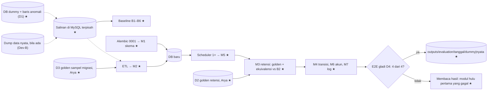

# 002a · Dev · Rancang evaluasi basis data

Disetujui: 2026-10-04
Produk: Sistem Tupoksi Arsiparis SMKN 7 Bandung · Jenis: Aplikasi bisnis (web, Flask + MySQL) · Data: tingkat 0 untuk data asli; data uji Dev-A = dump database dummy buatan tim + ±10 baris anomali buatan Arya, aman dibaca AI; mode data rahasia tidak aktif
Dasar: 001a (docs/rancangan/001a_2026-10-04_dev-desain-ulang-basis-data.md). Status data yang berlaku ada di docs/keputusan-produk.md (Riwayat 2026-10-04); kepala file 001a yang masih bertuliskan "tingkat 3" sudah usang.
Dokumen terkait: docs/keputusan-produk.md | docs/rencana-evaluasi.md

## Diagram alur



## Yang dirancang atau diubah

Rancangan pertama untuk evaluasi. Tidak ada rencana evaluasi sebelumnya.

| Jenis | Bagian | Sebelumnya | Sekarang |
|---|---|---|---|
| Baru | Pembagian tahap | — | Dev-A di dump dummy (mekanik; sekarang) · Dev-B di dump data nyata (hanya bila data nyata ada sebelum cutover) |
| Baru | D1 Salinan database lama | — | Dump di-restore ke MySQL terpisah; database asal tidak disentuh; Dev-A = dummy + ±10 baris anomali buatan Arya (minimal satu per butir B4), dump diambil setelah anomali ditambahkan |
| Baru | D2 Golden retensi | — | 30 kasus buatan Arya, 6 kelompok, 10 uji akhir |
| Baru | D3 Golden sampel migrasi | — | 32 record dummy dilabeli manual oleh Arya, satu baris per (record, kolom); sampel baru dari data nyata untuk Dev-B |
| Baru | D4 Kunci spesifikasi | — | Model data dan tabel transisi di 001a sebagai kunci M1 dan M4 |
| Baru | M1–M7 + E2E | — | Kartu metrik di bawah, target persis |
| Baru | Baseline B1–B6 | — | Diukur sebelum pembangunan 001 |
| Baru | Gate 1–7 | — | Lihat Rincian engineering |
| Baru | Alat evaluasi (dibangun pink-chan) | — | Konversi + pemeriksaan spreadsheet, pemilih record acak, skrip baseline, skrip evaluasi per modul + E2E, fixture test; semua menerima parameter koneksi DB dan `tanggal_uji` |

Tidak berubah: rancangan 001 (skema, K1–K8).

## Rincian engineering

### Pembagian tahap dan berlakunya metrik
| Modul | Target | Cara menilai | Berlaku final di |
|---|---|---|---|
| M1 Skema | Kesesuaian 1,00; Penolakan 100% | Otomatis | Dev-A |
| M2 ETL | Kelengkapan 1,00 per entitas; Fidelitas_sampel 100%; Gagal_peta 0; Δ_file 0; hash sama; Integritas 0 | Otomatis + D3 | Dev-A = mekanik; Dev-B = final bila data nyata ada |
| M3 Retensi | Akurasi_golden 100% per kelompok; Selisih 0; kandidat ijazah 0; Cakupan_kandidat > 0 (sementara) | D2 + otomatis | Golden: Dev-A. Ekuivalensi: Dev-A = mekanik; Dev-B = final |
| M4 State machine | Cakupan 100%; Kebenaran 100% | Otomatis | Dev-A |
| M5 Scheduler | n_update = predikat; jalan kedua 0; 1 baris log | Otomatis | Dev-A |
| M6 Akun | 1,00; 1,00; hash 100% identik; 1 login Arya | Otomatis + manual | Dev-A = mekanik; Dev-B = final |
| M7 Log | FK_valid 100%; PII 0 | Otomatis | Dev-A |
| E2E | 4 dari 4 | Otomatis + manual | Dump yang benar-benar dimigrasikan (Gate 6) |

### Dataset

**Kelompok wajib pedoman umum** (`ada_di_dokumen`, `tidak_ada_di_dokumen`, `di_luar_cakupan`, `sulit`) tidak berlaku, karena produk ini bukan sistem tanya-jawab. ±⅓ uji akhir dan kolom `diverifikasi` tetap berlaku.

**D1 · Salinan database lama.** Dev-A: dump database dummy setelah Arya menambahkan ±10 baris anomali (minimal satu per butir B4), di-restore ke MySQL terpisah; AI boleh membaca isinya. Dev-B: dump data nyata bila ada; kerahasiaannya diputuskan Arya, dan sampai saat itu berlaku Gate 4. `tanggal_uji` adalah parameter yang sama untuk semua pengukuran satu putaran.

**D2 · Golden retensi** (Arya, 30 kasus, 10 uji akhir) → `data/evaluation/golden_retensi.jsonl`
| Kelompok | Jumlah | Menguji |
|---|---|---|
| `normal_musnah` | 6 | Lewat masa inaktif, destroy, tiap jenis arsip |
| `batas_tahun` | 6 | y = x + n (belum lewat) vs y = x + n + 1 (lewat), masa aktif dan masa akhir |
| `berkas_terbuka` | 4 | `closed_year` kosong |
| `ijazah` | 4 | Diambil vs belum; IJZ (assess) tidak pernah kandidat musnah |
| `assess_permanen` | 4 | `perlu_dinilai` / `kandidat_permanen` |
| `status_lain` | 6 | Active belum jatuh tempo, destroyed/permanent, sedang di disposal proposed/approved |

Kolom: `id` (R001…) · `kelompok` · `archive_type` · `archive_year` · `closed_year` (boleh kosong) · `retention_active_years` · `retention_inactive_years` · `final_action` · `status_awal` · `disposal_terbuka` (ya/tidak) · `tanggal_uji` (YYYY-MM-DD) · `label_jatuh_inaktif` (ya/tidak) · `label_daftar` (kandidat_musnah/perlu_dinilai/kandidat_permanen/tidak_ada) · `bagian` (perbaikan/uji_akhir) · `diverifikasi` · `catatan` (opsional). Semua wajib kecuali `catatan`.

**D3 · Golden sampel migrasi** (Arya, 32 record, ±⅓ uji akhir) → `data/evaluation/golden_sampel_migrasi.jsonl`
| Kelompok | Record | Kolom berlabel |
|---|---|---|
| `incoming_letter` | 5 | archive: archive_type, title, archive_year, closed_year, status, kode klasifikasi, nama lokasi, attachment_path · letter_number, letter_date, received_date, sender |
| `outgoing_letter` | 5 | archive (sama) · letter_number, letter_date, sent_date, destination, is_decree, approval_status |
| `diploma` | 5 (≥ 1 belum diambil) | archive (sama) · diploma_number, student_name, nama jurusan, collected_at |
| `finance_record` | 5 | archive (sama) · kode kategori, period_month, amount |
| `employee_document` | 5 (≥ 1 tanpa klasifikasi lama) | archive (sama) · id pegawai lama, kode jenis dokumen |
| `employee` | 5 | gender, nama status kepegawaian, nama status aktif, nama golongan |
| `app_user` | 2 | username, is_active |

Kolom (satu baris per record × kolom): `id` (S001…) · `sumber_data` (dummy/nyata) · `kelompok` · `id_lama` · `kolom_baru` (mis. `archive.closed_year`) · `nilai_harapan` (tanggal YYYY-MM-DD, angka tanpa titik/Rp, kosong = NULL) · `bagian` (sama untuk satu record) · `diverifikasi` · `catatan` (opsional).

**D4 · Kunci spesifikasi:** model data Logical dan tabel transisi di 001a.

**Alat bantu:**
- Konversi spreadsheet → jsonl dengan penolakan baris (beserta alasannya) bila: `id` kosong atau ganda; nilai di luar domain; `label_daftar` ≠ `tidak_ada` padahal `label_jatuh_inaktif` = tidak; `diverifikasi` kosong pada baris yang masuk gate; `kolom_baru` tidak ada di skema.
- Pemilih record acak per kelompok untuk D3, yang hanya menampilkan id lama.
- Fixture test kecil untuk menguji alat dan jalur anomali; angkanya tidak dipakai untuk gate.
- Semua skrip menerima parameter koneksi DB dan `tanggal_uji`.

### Kartu metrik

```
M1 · Schema conformance + constraint enforcement — Umum
Rumus        E = item skema yang diharapkan dari 001a: tabel; (tabel, kolom,
             tipe, nullable, default); PK; (FK, tabel rujukan, ON DELETE);
             UNIQUE; CHECK (nama convention); indeks
             A = item yang sama dari information_schema
             Kesesuaian = |E ∩ A| / |E ∪ A|
             Penolakan = Σ pelanggaran ditolak / Σ kasus pelanggaran
             (1 kasus negatif per CHECK, UNIQUE, FK, NOT NULL)
Target       1,00 · 100%
Laporan      E \ A dan A \ E
```

```
M2 · ETL completeness, fidelity, idempotence, integrity — Umum
Rumus        Kelengkapan(e) = n_baru(e) / n_lama(e): 5 jenis arsip,
             employee, app_user, storage_location, activity_log (= log),
             classification (n_lama + 2 placeholder)
             Lookup: n_baru(kategori) ≥ n_master_reference(kategori); baris
             tambahan dilaporkan
             Fidelitas_sampel = Σ kolom benar / Σ kolom D3 (per kelompok,
             per bagian)
             Gagal_peta = nilai archive_status/final_action/approval_status/
             gender yang tidak terpetakan
             Δ_file = |path lama dengan file ada| − |path baru dengan file ada|
             Idempotensi: hash berurutan semua baris semua tabel, ETL ke-1 =
             ke-2 (DB kosong, tanggal ETL sama)
             Integritas = archive tanpa rincian sesuai type + rincian ganda +
             other dengan rincian + destroyed tanpa item executed + arsip di
             > 1 disposal terbuka
Target       1,00 · 100% (uji_akhir) · 0 · 0 · sama · 0
Syarat       Setiap baris anomali B4 tertangkap pra-cek atau dilaporkan
             sesuai K7; tidak boleh hilang tanpa jejak
```

```
M3 · Retention correctness + equivalence — Umum
Rumus        Akurasi_golden(k) = Σ benar(k) / Σ kasus(k) per kelompok D2
             L = {(jenis, id_lama)} /disposal/check lama, tanpa ijazah
             N = kandidat_musnah baru setelah scheduler 1×, id lama
             Selisih = |L △ N| ;  J = |L ∩ N| / |L ∪ N|
             Kandidat ijazah = |N_ijazah| ; Cakupan_kandidat = |L|
Parameter    tanggal_uji sama untuk lama dan baru; boleh dimajukan khusus
             ekuivalensi bila |L| = 0 di dummy (E5)
Target       100% per kelompok (uji_akhir) · 0 · 0 · > 0 (sementara)
Laporan      id di L \ N dan N \ L bila Selisih > 0
```

```
M4 · State machine coverage — Umum
Rumus        P_arsip = {(baru), active, inactive, destroyed, permanent} ×
             {active, inactive, destroyed, permanent}
             P_disposal = {(baru), proposed, approved, rejected, executed} ×
             {proposed, approved, rejected, executed}
             Cakupan = diuji / |P_arsip ∪ P_disposal|
             Kebenaran = sesuai tabel transisi 001a / diuji
             + edit hanya active/inactive; hapus fisik hanya active dan belum
             pernah di disposal; item hanya diubah saat proposed; eksekusi
             atomik
Target       100% · 100%
```

```
M5 · Scheduler correctness — Umum
Rumus        n_update = |{a : status='active' ∧ closed_year IS NOT NULL ∧
             closed_year + retention_active_years < y}| (SELECT sebelum
             UPDATE); jalan kedua n_update = 0; 1 baris 'retention_run'
             dengan angka = n_update; Waktu_jalan (ms) informasi (sementara)
Target       sama persis · 0 · 1 baris sesuai
```

```
M6 · Account migration — Umum
Rumus        Admin_aktif = |app_user aktif| / |user lama admin ∧ active|
             Non_admin_nonaktif = |non-admin lama is_active=0| /
             |non-admin lama| ; password_hash identik dengan kolom lama
Target       1,00 · 1,00 · 100% + Arya login 1× dengan NIP dan sandi lama
```

```
M7 · Activity log integrity — Umum
Rumus        FK_valid = baris user_id NULL atau ada di app_user / semua
             PII = baris non-'legacy' dengan deretan 16–18 digit di summary
             atau nilai employee.address
Target       100% · 0 (tetap diperiksa di dummy: yang diuji perilaku kode)
```

```
E2E · Cutover rehearsal (D4 rancangan 001) — Umum
Rumus        Lulus = D4-1 ∧ D4-2 ∧ D4-3 ∧ D4-4 dalam satu jalan:
             alembic upgrade → ETL → scheduler 1× → M1–M7
             Waktu_ETL (menit) informasi
Target       4 dari 4
```

### Membaca hasil
Urutan: M1 → M2 → M5 → M3 → M4/M6/M7 → E2E. Modul hulu pertama yang gagal adalah tersangka utama.
| Pola hasil | Kesalahan ada di |
|---|---|
| Kesesuaian_skema < 1 | Alembic 0001 / model ORM (lihat E \ A, A \ E) |
| Penolakan < 100% hanya CHECK | MySQL < 8.0.16 atau Enum tanpa `create_constraint=True` |
| Kelengkapan < 1 satu jenis | ETL langkah 4 atau pra-cek yang melewatkan baris |
| Baris anomali B4 hilang tanpa laporan | ETL langkah 1 atau 3 |
| Fidelitas rendah di kolom lookup | ETL langkah 3 |
| Fidelitas rendah di closed_year/archive_year | ETL langkah 4 (ijazah, pegawai) |
| Fidelitas rendah hanya di uji_akhir | ETL disesuaikan berlebihan ke baris perbaikan |
| Idempotensi gagal | ETL memakai NOW() atau urutan tak tetap |
| Akurasi_golden < 100% | Rumus K5 |
| Akurasi_golden 100%, Selisih > 0 | Data ETL atau scheduler belum jalan; cek M2, M5 |
| Selisih hanya di pegawai | document_year/created_at atau TANPA-KLAS |
| Kandidat ijazah > 0 | Ijazah tidak memakai IJZ atau closed_year salah |
| Lulus Dev-A, gagal Dev-B | Pola data nyata tidak ada di dummy; tambah ke B4 dan perbaiki ETL |
| n_update ≠ predikat | SQL scheduler |
| Kebenaran M4 < 100% | Fungsi domain transisi |
| PII > 0 | Pembentuk summary log |

### Baseline
Diukur di D1 (Dev-A: dummy + baris anomali; Dev-B: dump data nyata) sebelum ETL dan sebelum perubahan apa pun.
| # | Yang diukur | Untuk |
|---|---|---|
| B1 | Jumlah baris per tabel lama, per archive_status, per jenis arsip | M2 |
| B2 | Himpunan L dari `/disposal/check` lama pada tanggal_uji | M3 |
| B3 | Yang akan diubah scheduler lama pada tanggal_uji | Informasi |
| B4 | Anomali: nomor surat keluar ganda, status di luar domain, academic_year tidak berformat, nilai gender, string referensi tak cocok, ijazah diambil tanpa tanggal, pegawai tanpa klasifikasi | Pra-cek ETL; keputusan Arya sebelum gladi |
| B5 | Lampiran dengan file ada / hilang | M2 Δ_file |
| B6 | Waktu `/disposal/check` lama dan get_all per modul + jumlah baris | Informasi (sementara) untuk rancangan back-end |

### Gate
1. Baseline B1–B6 diukur dan disimpan sebelum langkah pembangunan 001 dimulai.
2. Setiap langkah di 001b wajib mencapai target modul yang ditargetkannya, di Dev-A.
3. Target persis. Metrik yang sudah lulus lalu turun di langkah berikutnya (berapa pun penurunannya) membuat langkah itu di-rollback atau diperbaiki sebelum lanjut.
4. Hasil disimpan di `outputs/evaluation/<tanggal>/<dummy|nyata>/`. Dummy: isi baris lengkap boleh. Data nyata: angka dan id saja sampai Arya menyatakan aman dibaca AI.
5. Angka dummy dan data nyata tidak pernah digabung. M2, ekuivalensi M3, M6, dan E2E final hanya dari data nyata bila ada; M1, golden M3, M4, M5, dan M7 final di Dev-A.
6. Cutover (rancangan back-end) mensyaratkan E2E 4/4 di dump yang benar-benar dimigrasikan. Tanpa data nyata, cutover ke DB baru kosong + data master, dan E2E di dummy cukup sebagai bukti mekanik.
7. Kalau data nyata tidak pernah datang sampai serah terima, dicatat: **ETL belum diuji pada data nyata.**

### Asumsi
E1 Arya bisa dump dan restore ke MySQL ≥ 8.0.16 terpisah · E2 kode lama bisa dijalankan dengan tanggal uji yang ditetapkan · E3 target persis untuk modul deterministik, kecuali ijazah · E4 30 kasus dan 32 record cukup; pengukuran lengkap atas semua baris · E5 dummy mencakup 5 jenis dan ada arsip yang lewat retensi, kalau tidak tanggal_uji ekuivalensi boleh dimajukan · E6 dummy dan baris anomali buatan tim/Arya, bukan agent; angkanya tidak mewakili data nyata.

## Laporan rancangan

Produk: Aplikasi bisnis (web) — Sistem Tupoksi Arsiparis SMKN 7 Bandung. Ini rancangan evaluasi 002 untuk rancangan 001, desain ulang basis data.
Fase: Dev
Dasar: docs/rencana-evaluasi.md usulan putaran sebelumnya (TP1–TP4 dijawab, semua a) + informasi Arya: "data pada db saat ini semuanya dummy, jadi aman untuk dikirim ke server anthropic".
Status: menunggu persetujuan → disetujui 2026-10-04

Diagnosis (dampak informasi "data dummy"):
- Status data salah di kedua dokumen. Yang benar: tingkat 0 untuk data asli. DB saat ini seluruhnya dummy buatan tim; ada tidaknya data arsip nyata belum pasti.
- Mode data rahasia tetap tidak aktif. Dummy aman dibaca AI; untuk data nyata, Arya yang memutuskan nanti.
- Aturan keluaran "angka + id saja" sebelumnya dibuat karena PII. Untuk dummy tidak perlu (isi lengkap boleh); untuk data nyata tetap berlaku sampai Arya menyatakan sebaliknya.
- Golden sampel migrasi diambil dari record dummy; label tetap manual sehingga pemeriksaan tidak berputar pada kode ETL. Data nyata → sampel baru.
- Baseline B2/B3 di dummy masih sah untuk ekuivalensi logika lama vs baru. B4 dan B6 tidak mewakili data nyata. Ekuivalensi hanya bermakna kalau |L| > 0.
- Dummy buatan tim, bukan agent: dipakai untuk mekanik, angkanya tidak mewakili data nyata.
- Tanpa data nyata, ETL hanya memindahkan dummy, sehingga cutover yang masuk akal adalah DB baru kosong + data master. ETL tetap berguna kalau sekolah mulai memakai aplikasi lama sebelum cutover (TP5).

Gambaran sistem (alur evaluasi):
```
Dev-A (sekarang)                              Dev-B (hanya bila data nyata ada)
[DB dummy] ──dump──→ [D1 salinan] ──→ Baseline B1–B6 ★
                          │            (B4/B6 tidak mewakili data nyata)
                          ▼
   Alembic 0001 ──→ [DB baru] ←── ETL (K7) ──→ M2 mekanik     [dump data nyata]
        │               │                       ▲                    │
        ▼               ▼                 [D3 sampel dummy]          ▼
   M1 skema       Scheduler 1× ──→ M5                       Ulang M2, M3-ekuiv.,
        (final)         │ (final)                           M6, E2E + D3 nyata
                        ▼                                   (keluaran: angka+id)
         M3: golden (final) + ekuivalensi (mekanik)               │
   M4, M7 (final) · M6 (mekanik) ──→ E2E di dummy                 ▼
                        └──── cutover: dump nyata bila ada, ────→ Gate 6
                              kalau tidak: DB baru kosong + master
 ┄┄→ [outputs/evaluation/<tanggal>/<dummy|nyata>/]
```

Bentrokan:
- Data pengganti harus publik, sedangkan yang tersedia dummy buatan tim: hanya untuk mekanik, tidak pernah digabung dengan angka data nyata (Gate 5, E6).
- ETL vs tidak adanya data nyata: ETL tetap dibangun; dijalankan atau tidaknya saat cutover diputuskan lewat TP5 dan rancangan back-end.
- Ekuivalensi M3 bisa kosong di dummy: metrik Cakupan_kandidat; tanggal_uji boleh dimajukan (E5).
- PII M7 di dummy: tetap diperiksa karena yang diuji perilaku kode.

Riset: 0 pencarian, 0 halaman (metrik kebenaran dan himpunan; references/data.md); sumber dilarang yang dilewati: 0.

## Titik periksa dan pilihan Arya
1. [Sampel] a. 32 record (Usulan) ✓ 2026-10-04
2. [Tempat uji] a. Dump di-restore ke MySQL terpisah (Usulan) ✓ 2026-10-04
3. [Kasus] a. 30 kasus dalam 6 kelompok, 10 uji akhir (Usulan) ✓ 2026-10-04
4. [Kinerja] a. Diukur sebagai informasi saja, target di rancangan back-end (Usulan) ✓ 2026-10-04
5. [Data asli] a. Belum pasti — ETL tetap dibangun dan dievaluasi di dummy; Dev-B bila data nyata muncul; tanpa data nyata, cutover ke DB baru kosong + data master (Usulan) ✓ 2026-10-04
6. [Anomali] a. Arya menambah ±10 baris anomali ke database dummy sebelum baseline, mengikuti daftar B4 (Usulan) ✓ 2026-10-04

## Koreksi selama putaran
- Arya: "data pada db saat ini semuanya dummy, jadi aman untuk dikirim ke server anthropic." Akibatnya: status data diubah menjadi tingkat 0 + dump dummy; pembagian Dev-A/Dev-B; aturan keluaran dibedakan untuk dummy dan data nyata; Gate 4–7; Cakupan_kandidat; E5, E6; TP5–TP6. Status data di docs/keputusan-produk.md ikut dikoreksi (Riwayat).

## Perintah untuk pink-chan
pink-chan, susun rencana pembangunan dari docs/rancangan/002a_2026-10-04_dev-rancang-evaluasi-basis-data.md
