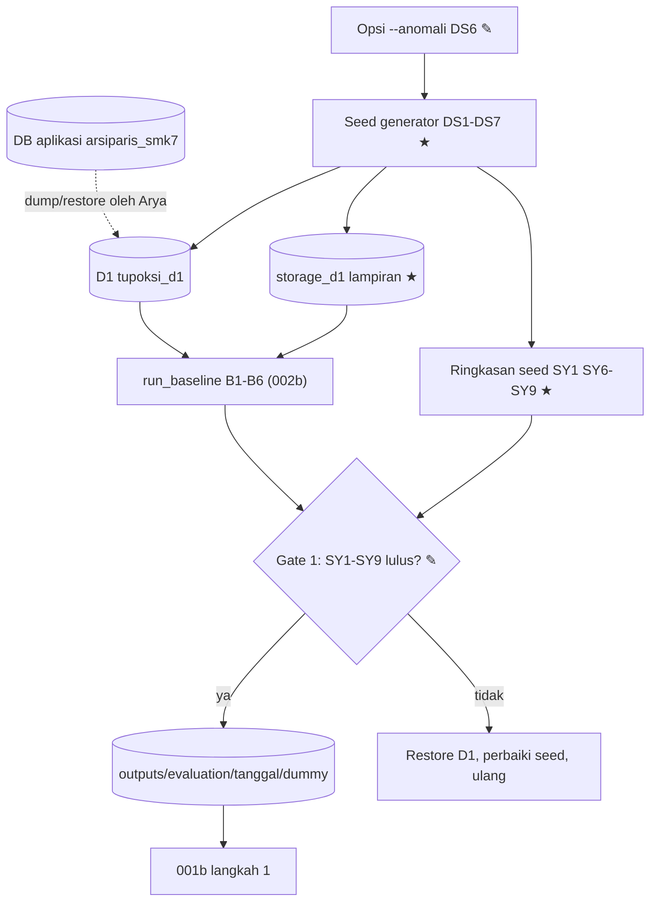

# 003a · Dev · Rancang evaluasi data seed Dev-A

Disetujui: 2026-10-05
Produk: Sistem Tupoksi Arsiparis SMKN 7 Bandung · Jenis: Aplikasi bisnis (web Flask + MySQL) · Data: tingkat 0 (belum ada data arsip); data uji Dev-A = D1 + seed deterministik pink-chan; mode data rahasia tidak aktif
Dasar: 001a (desain ulang basis data), 002a/002b (rancang evaluasi basis data)
Dokumen terkait: docs/keputusan-produk.md | docs/rencana-evaluasi.md

## Diagram alur



## Yang dirancang atau diubah
Dibanding 002a:
| Jenis | Bagian / keputusan | Sebelumnya | Sekarang |
|---|---|---|---|
| Diubah | Data (keputusan-produk, rencana-evaluasi) | Tingkat 0; DB lama berisi dummy dan dipakai sebagai data uji | Tingkat 0; belum ada data arsip (1 akun, 1 pegawai, 203 log, 35 referensi, 1 klasifikasi); data uji Dev-A = D1 + seed deterministik pink-chan |
| Diubah | keputusan-produk A5, D3, D4, Bentrokan "ETL vs dummy", K7 catatan cutover | Dummy | Belum ada arsip; Dev-A = D1 + seed; baris seed tidak ikut cutover |
| Baru | keputusan-produk Bentrokan "seed dan ETL ditulis agent yang sama"; Belum pasti: profil untuk preset volume, ETL arsip destroyed berlampiran; Gambaran sistem: baris seed | — | Ada |
| Diubah | rencana-evaluasi D1 Dev-A | Dump dummy + ±10 anomali buatan Arya | D1 + seed `penuh` + `--anomali` |
| Baru | rencana-evaluasi D1-S: DS1–DS7, SY1–SY9 | — | Spesifikasi seed dan syarat data uji |
| Diubah | TP6 | a ✓ (Arya mengisi anomali) | c ✓: nilai diisi agent atas permintaan Arya, dijalankan lewat seed `--anomali` |
| Baru | TP7–TP11 | — | Data uji dari seed; volume; tempat seed; anomali; penanda |
| Diubah | E5, E6 | Dummy diharapkan L > 0; dummy dibuat tim/Arya | Seed menjamin SY1–SY5; seed dan anomali dibuat agent atas keputusan Arya, Dev-A hanya mekanik |
| Baru | E7, E8 | — | Volume perkiraan (sementara); master_reference memuat kategori wajib |
| Diubah | Gate 1 | Baseline di dump dummy | Baseline sah hanya bila SY1–SY9 lulus; baseline D1 kosong tidak dipakai |
| Diubah | B4, B6, M2, M3 Cakupan_kandidat, M5, M6, Membaca hasil, Gate 6 | Mengacu dummy/anomali Arya | Mengacu seed/DS6 |
| Usang | `scripts/evaluation/b4_anomali_dev_a.sql`, `b4_anomali_template.sql` | Dijalankan Arya sebelum dump | Tidak dijalankan; digantikan DS6 |
Tidak berubah: skema dan K1–K8 rancangan 001; metrik M1–M7 dan E2E; golden D2/D3 (tetap ditulis Arya); Gate 2–5 dan 7; alat baseline 002b.

## Rincian engineering

```
DS1 · Write-guarded seed target — Umum (pengetahuan umum)
Pendekatan   Seed hanya MENAMBAH baris ke skema lama (12 tabel) di D1;
             tanpa DDL, tanpa UPDATE/DELETE baris yang sudah ada
Parameter    EVAL_SEED_DB_URL (baru): harus menunjuk database yang sama
             dengan EVAL_OLD_DB_URL dan berbeda dari DATABASE_URL aplikasi
             EVAL_SEED_STORAGE_ROOT (baru): wajib diisi, bukan folder
             storage/ aplikasi; usulan data/evaluation/storage_d1/
Penjaga      Berhenti sebelum menulis apa pun bila: target = DB aplikasi;
             salah satu dari 5 tabel arsip atau storage_location tidak
             kosong; sudah ada baris berpenanda DUMMY; kategori wajib
             master_reference (school_major, teacher_emp_status,
             teacher_active_status, finance_category, emp_doc_type) kosong
             (teacher_rank opsional → rank NULL semua)
Transaksi    Semua baris DB dalam satu transaksi; berkas lampiran ditulis
             setelah commit. Gagal di tengah → restore D1 lalu ulang
             (tidak ada jalan ulang parsial)
Metrik       SY8
```

```
DS2 · Deterministic generation — Umum
Pendekatan   random.Random(seed); semua nilai dari generator ini; urutan
             insert tetap (per tabel, lalu per tahun, lalu nomor urut)
Parameter    --seed (default 20261005) · --tahun-acuan Y₀ (default 2026)
             · --skala kecil|penuh (Gate 1: penuh) · --anomali
             Semua DATE/DATETIME, termasuk created_at dan updated_at,
             diisi eksplisit dari tahun dokumen (tidak ada NOW()/CURDATE()).
             Nama file lampiran = hex 32 karakter dari generator (bukan uuid4)
Syarat pakai tanggal_uji baseline harus berada di tahun Y₀
Metrik       SY7: dua jalan dengan parameter sama ke dua salinan D1 yang
             sama → hash berurutan semua baris identik (memakai fungsi hash
             M2); seed berbeda → hash berbeda
```

```
DS3 · Stratified coverage + seeded random fill — Umum
Pendekatan   (1) baris cakupan wajib (DS4, C1–C8), lalu
             (2) baris isian acak sampai volume preset tercapai
Klasifikasi  7 baris dummy (code ≤ 10 karakter, name ≤ 50, unik):
             code     a   i   final_action
             DMY-D11  1   1   destroy
             DMY-D23  2   3   destroy
             DMY-D55  5   5   destroy
             DMY-D10  1   0   destroy
             DMY-DXX  10  10  destroy      (tidak pernah jatuh di rentang isian)
             DMY-P55  5   5   permanent
             DMY-A25  2   5   assess
             Bukan kode JRA; tidak boleh dipakai sebagai acuan retensi nyata
Volume       preset penuh (per tahun Y₀−10 … Y₀, 11 tahun):
               incoming 800/th · outgoing 500/th · diploma 450/angkatan ·
               finance 150/th · pegawai 120 × ±10 dokumen
               ≈ 22.000 arsip (asumsi perkiraan satu SMK, sementara)
             preset kecil = penuh ÷ 10 (≈ 2.200 arsip, 12 pegawai)
             Baris cakupan ditambahkan di atas volume preset
Sebaran isian
             tahun dokumen  seragam Y₀−10 … Y₀
             klasifikasi    seragam dari 7 (4 jenis ber-klasifikasi)
             status         active 60% · inactive 25% · destroyed 10% ·
                            permanent 5%; destroyed hanya dengan final_action
                            destroy dan sudah lewat masa akhir;
                            permanent hanya dengan permanent/assess
             referensi      70% code persis · 20% name persis · 10% varian
                            huruf besar/kecil atau spasi (semua tetap cocok)
             gender         L 40% · P 40% · Laki-laki 10% · Perempuan 10%
             rank           70% terisi bila teacher_rank ada, sisanya NULL
             period_month   NULL 20%, sisanya 1–12
             amount         NULL 10%, sisanya kelipatan 1.000 di
                            100.000–500.000.000
             document_year  NULL 5% (memicu fallback created_at.year lama)
             ijazah         is_collected 70%; collected_at di tahun ajaran
                            akhir s.d. +3 tahun
Cakupan wajib (minimal 1 baris per sel, sebelum isian)
  C1 tiap jenis ber-klasifikasi × tiap klasifikasi × status
     {active, inactive}
  C2 tiap jenis ber-klasifikasi × status {destroyed, permanent}: ≥ 3
  C3 surat masuk letter_date Desember x, received_date Januari x+1: ≥ 5;
     surat keluar sent_date beda tahun dari letter_date: ≥ 5
  C4 surat masuk/keluar active di tahun Y₀−a, bulan Januari dan Desember
     (memperlihatkan beda per-tanggal lama vs per-tahun K5): ≥ 1 per
     klasifikasi
  C5 ijazah: tiap angkatan punya diambil dan belum diambil; ≥ 5 diambil
     dengan tahun awal < Y₀−5 (L ijazah lama > 0)
  C6 dokumen pegawai dengan document_year NULL: ≥ 5, created_at
     tersebar di beberapa tahun
  C7 tiap kategori referensi: bentuk code, name, dan varian masing-masing ≥ 1
  C8 user: admin-inactive, teacher-active, teacher-inactive,
     headmaster-active (admin aktif = akun lama yang sudah ada)
Larangan     Seed tidak membuat satu pun pola B4 (anomali hanya dari DS6)
Metrik       SY1, SY4
```

```
DS4 · Retention boundary rows — Umum
Rumus        Untuk tiap jenis ber-klasifikasi dan tiap klasifikasi (a, i):
             x_akhir_batas = Y₀ − (a+i)        → tidak masuk L lama
             x_akhir_lewat = Y₀ − (a+i) − 1    → masuk L lama (bila destroy)
             x_aktif_batas = Y₀ − a            → tidak jatuh inaktif (K5)
             x_aktif_lewat = Y₀ − a − 1        → jatuh inaktif (K5)
             x = tahun dokumen (letter_date.year, fiscal_year,
             document_year). Status baris akhir = inactive, baris aktif =
             active. Baris batas boleh lebih tua dari Y₀−10
             (DMY-DXX → x = Y₀−21)
Kenapa       Kondisi lama current_year > x+n dan K5 x+n < y bertemu tepat di
             batas; baris di dua sisi batas menguji ekuivalensi M3 dan
             scheduler M5 di titik yang paling mungkin salah
Metrik       SY6
```

```
DS5 · Attachment fixtures (B5) — Umum
Pendekatan   Path ditulis dalam format lama:
             storage/documents/<subfolder route lama>/<hex32>.txt
Parameter    40% baris non-destroyed punya path; dari baris itu, 10% sengaja
             tanpa berkas (hilang); destroyed selalu NULL (perilaku
             execute_disposal lama). Isi berkas: satu baris
             "DUMMY lampiran <tabel> <id>". Berkas dibuat di
             EVAL_SEED_STORAGE_ROOT; saat baseline,
             EVAL_STORAGE_ROOT diarahkan ke folder yang sama
Metrik       SY5
```

```
DS6 · B4 anomaly rows (opsi --anomali) — Umum
Pendekatan   Opsi --anomali menambah baris dengan nilai yang sama dengan
             b4_anomali_dev_a.sql (7 butir; B4-1 = satu pasang nomor ganda),
             tetapi tanggal dari Y₀ (1 Juli Y₀), bukan CURDATE(). Induk tetap
             klasifikasi permanent supaya tidak masuk L atau B3. Penanda
             ANOMALI- tetap dipakai. File b4_anomali_dev_a.sql dan
             b4_anomali_template.sql ditandai usang dan tidak dijalankan
Catatan      Nilai diisi agent atas permintaan Arya → B4 Dev-A hanya bukti
             mekanik (E6)
Metrik       SY4
```

```
DS7 · Dummy marker, no realistic PII — Umum
Pendekatan   Setiap baris baru bisa dikenali dari penanda:
             subject/title/document_name/name diawali "DUMMY "; nomor surat
             "DMY/IN|OUT/<tahun>/<nnnn>"; ijazah "DMY-IJZ-<tahun>-<nnnn>";
             student_name "Siswa Dummy <tahun>-<nnnn>"; full_name
             "Pegawai Dummy <nnn>"; address "Alamat Dummy <nnn>";
             identity_number 18 digit berawalan "9900" (bulan 00 → bukan NIP
             sah, tetapi tetap tertangkap pola PII M7); storage_location
             "DUMMY Lemari <nn>"
             password_hash akun seed = satu konstanta hash argon2 dari sandi
             acak yang tidak disimpan → akun seed tidak bisa dipakai login
             (login manual M6 tetap memakai akun admin lama)
             Seed tidak menulis log
Metrik       SY8, SY9
```

Syarat data uji (Gate 1):
| # | Syarat | Target |
|---|---|---|
| SY1 | B1: tiap jenis arsip punya baris di keempat status; volume ≥ preset | ya |
| SY2 | B2: \|L\| > 0 untuk tiap jenis non-ijazah, dan L ijazah > 0 | ya |
| SY3 | B3 > 0 untuk incoming, outgoing, dan finance | ya |
| SY4 | B4 = 0 setelah seed tanpa anomali; tepat 1 per butir dengan `--anomali` | ya |
| SY5 | B5: ada dan hilang masing-masing > 0 untuk tiap jenis | ya |
| SY6 | Tiap (jenis, klasifikasi) punya keempat baris batas DS4 | 100% |
| SY7 | Hash identik untuk parameter sama, berbeda untuk seed berbeda | ya |
| SY8 | Baris berpenanda = baris yang ditambahkan; hash baris lama sebelum = sesudah | ya |
| SY9 | Tidak ada nama tanpa "Dummy"; semua identity_number baru berawalan 9900 | 0 pelanggaran |

Alternatif yang ditolak:
| Pendekatan | Ditolak karena |
|---|---|
| Arya mengisi manual lewat aplikasi lama | Keputusan Arya; lambat dan tidak bisa dibuat ulang persis |
| Data pengganti publik | Tidak ada dataset publik berskema arsip sekolah ini |
| Murni acak tanpa baris cakupan | L, B3, dan baris batas bisa kebetulan kosong |
| Tanggal relatif terhadap hari dijalankan | D1 berbeda tiap hari; B2 tidak bisa diulang |
| Seed ke DB aplikasi lalu dump | Scheduler aplikasi lama mengubah status dan merusak sebaran (TP2) |
| File SQL anomali terpisah | Dua langkah manual; `CURDATE()` (TP3) |
| Nama dan teks realistis | Bisa tertukar atau terbawa ke produksi (TP4) |

## Laporan rancangan

Produk: Aplikasi bisnis (web Flask + MySQL) — data uji Dev-A untuk evaluasi 002 dibangun ulang sebagai seed deterministik, bukan dump dummy
Fase: Dev
Dasar: 001a, 002a/002b (disetujui 2026-10-04); hasil run_baseline Arya; scripts/evaluation/b4_anomali_dev_a.sql
Status: selesai (disetujui 2026-10-05)

Diagnosis:
- Asumsi "database lama berisi dummy" (A5, E6, D1 Dev-A) salah: DB aplikasi tidak punya satu pun arsip (1 user, 1 teacher, 203 log, 35 master_reference, 1 classification); D1 sama dengan 0 classification.
- Akibatnya B2, B3, B4, B5 = 0: L kosong sehingga ekuivalensi M3 tidak menguji apa-apa (E5), B3 nol, B5 tanpa lampiran, B6 diukur terhadap 0 baris. Gate 1 secara teknis sudah jalan tetapi tidak bermakna; 001b belum boleh mulai langkah 1 atas dasar ini.
- B4: nilai anomali diisi agent, bukan Arya (menyimpang dari TP6 a dan E6) sehingga B4 di Dev-A hanya bukti mekanik. Script memakai `CURDATE()`, jadi isi D1 berbeda menurut hari dijalankan. Script belum dijalankan.
- Kode lama menentukan kebutuhan seed: `get_expired_archives` memakai tahun dokumen + masa aktif + inaktif per tahun (pegawai: `document_year`, fallback `created_at.year`), scheduler lama memakai received_date/sent_date + masa aktif per tanggal, ijazah hardcode 5 tahun hanya bila sudah diambil. Semuanya membaca `datetime.now()`, dan `created_at` diisi server `NOW()`. Seed wajib mengisi semua tanggal sendiri, termasuk `created_at`, supaya B2 tidak bergantung pada hari seed dijalankan.

Gambaran sistem:
```
[DB aplikasi arsiparis_smk7] ──dump/restore (Arya)──→ [D1 tupoksi_d1]
   1 akun, 1 pegawai, 203 log, 35 referensi              │ baris lama tidak
                                                          │ disentuh (DS1)
Seed generator ★ (DS1–DS7) ──seed tetap, tahun acuan──→ [D1] + [storage_d1 ★]
   └─ opsi --anomali ✎ (DS6, pengganti b4_anomali_dev_a.sql)
                                                          │
Ringkasan seed ★ (SY1, SY6–SY9) ←────────────────────────┤
run_baseline B1–B6 (002b, tidak berubah) ←───────────────┘
        │
        ▼
Gate 1 ✎ (SY1–SY9 lulus) ──ya──→ [outputs/evaluation/<tgl>/dummy] → 001b langkah 1
                         ──tidak──→ restore D1, perbaiki seed, ulang
```

Keputusan yang berubah: lihat tabel "Yang dirancang atau diubah" di atas.
Tidak berubah: skema 001 (K1–K8, model data); metrik M1–M7 dan E2E; golden D2/D3 (tetap ditulis Arya); Gate 2–7; alat baseline 002b.

Kartu engineering DS1–DS7 dan syarat SY1–SY9: lihat "Rincian engineering" di atas (isinya sama dengan laporan).

Desain UI/UX: tidak berlaku (cakupan D2 001).
Model data: tidak berubah dari 001a. Seed menulis ke skema lama apa adanya.

Bentrokan:
- Aturan `references/data.md` (tanpa konten tiruan buatan agent; hanya data publik) vs keputusan Arya memakai seed agent → dicatat sebagai penyimpangan yang disengaja. Diredam dengan isi struktural berpenanda DUMMY (DS7) tanpa nama orang dan tanpa NIP yang tampak sah; golden D2/D3 tetap ditulis Arya; angka Dev-A tidak pernah dipakai sebagai angka final (Gate 5).
- Seed dan ETL ditulis agent yang sama → Dev-A hanya bukti mekanik (E6). Fidelitas D3 tetap memakai label manual Arya, jadi tidak berputar.
- D1 vs aplikasi lama: kalau aplikasi lama dijalankan dengan DATABASE_URL ke D1, `create_app()` menyalakan scheduler yang mengubah status → D1 tidak boleh dipakai aplikasi lama.
- Klasifikasi DMY-* bukan JRA → tidak boleh terbawa ke cutover. ETL di Dev-A memindahkannya apa adanya; cutover tetap mengikuti TP5 002.
- Celah ETL 001: arsip destroyed yang masih berlampiran tidak dicakup B4 maupun pra-cek K7; CHECK `ck_archive_destroyed_file` membuat ETL gagal dengan error DB (terlihat, bukan diam-diam). Seed tidak membuat pola ini. Masuk Belum pasti.

Asumsi: volume `penuh` (±22.000 arsip, 120 pegawai, 11 tahun) adalah perkiraan umum satu SMK, bukan profil nyata (sementara); sebaran status/kolom DS3 adalah asumsi; master_reference D1 (35 baris) memuat lima kategori wajib; tanggal_uji Gate 1 berada di tahun 2026.
Riset: 0 pencarian, 0 halaman (pengetahuan umum + kode project); sumber dilarang yang dilewati: 0. Tidak ada teks bernada perintah di file yang dibaca.

## Titik periksa dan pilihan Arya
1. [Volume] Preset volume mana untuk Gate 1?
   a. Dua preset, Gate 1 memakai `penuh` (±22.000 arsip, 11 tahun) (Usulan) ✓ 2026-10-05
   b. Hanya `kecil` (±2.200 arsip)
   c. Arya memberi perkiraan profil data dulu
2. [Tempat seed] Ke database mana seed ditulis?
   a. Hanya ke D1 `tupoksi_d1` + folder lampiran terpisah; DB aplikasi tidak disentuh (Usulan) ✓ 2026-10-05
   b. Ke DB aplikasi `arsiparis_smk7`, lalu di-dump ke D1
3. [Anomali B4] Bagaimana baris anomali B4 dijalankan?
   a. Digabung ke seed sebagai opsi `--anomali`, nilai sama, tanggal dari tahun acuan; file SQL ditandai usang (Usulan) ✓ 2026-10-05
   b. File SQL tetap, dijalankan Arya setelah seed; CURDATE() diganti tahun acuan
4. [Penanda] Bentuk isi teks dummy?
   a. Penanda "DUMMY" di setiap kolom teks utama, NIP 18 digit berawalan 9900, tanpa nama orang (Usulan) ✓ 2026-10-05
   b. Nama dan teks berbahasa Indonesia realistis, penanda hanya di satu kolom

Di rencana-evaluasi.md, keempat titik periksa ini bernomor TP8–TP11. Di sana juga dicatat TP6 c dan TP7 (data uji dari seed, keputusan Arya).

## Koreksi selama putaran
Tidak ada (disetujui tanpa koreksi).

## Perintah untuk pink-chan
pink-chan, susun rencana pembangunan dari docs/rancangan/003a_2026-10-05_dev-rancang-evaluasi-data-seed.md
